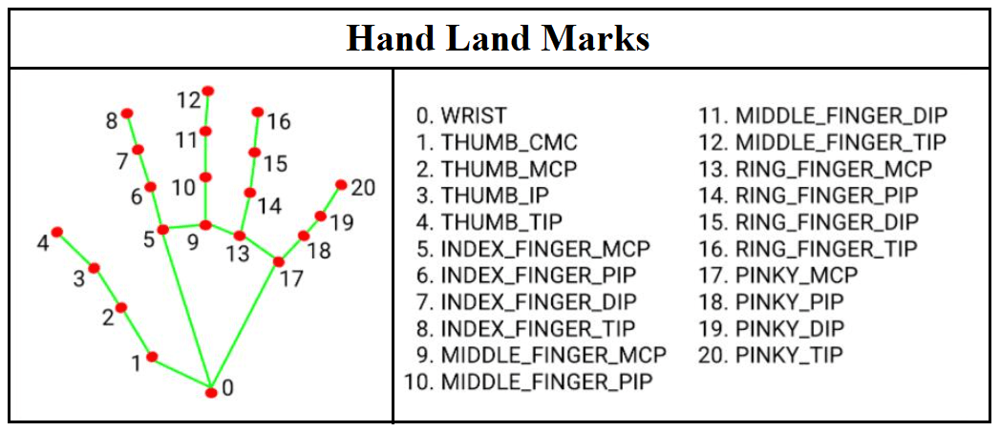

# Gesture-Controlled-Virtual-Mouse

### AI Virtual Mouse controlled by gesture using OpenCV and Mediapipe with Python.

    1- Hand and finger tracking.
    
    2- Options and features with the tracked fingers.
    
You can either use your computer's cam, or an external one such as ESP-CAM.

 In this example we have four options: Single click, double click, right click, press/release, which are of course customisable.
 
 ***Single click:*** Thumb (tip) with index (pip) fingers.
 
 ***Double click:*** Index (tip) with middle (tip) fingers.
 
 ***Right click:*** Middle (tip) with ring (tip) fingers.
 
 ***Press:*** Thumb (tip) with index (tip) fingers.
 
 _ _ _ 
 
#### We avoided using autopy since it doesn't run on all Python versions **(Python 2.7, or Python 3.5 til 3.8)** which makes it limited so the required libraries are:
 

    1- OpenCV Python
    
    2- Numpy & Math
    
    3- Mediapipe
    
    4- Mouse
    
    5- Time
    
Please, check this documentation if you have never worked with Mediapipe: https://google.github.io/mediapipe/solutions/hands

Python Object Oriented Programming course: https://www.youtube.com/watch?v=ZDa-Z5JzLYM&list=PL-osiE80TeTsqhIuOqKhwlXsIBIdSeYtc

Numpy tuto for beginners : https://www.youtube.com/watch?v=QUT1VHiLmmI

